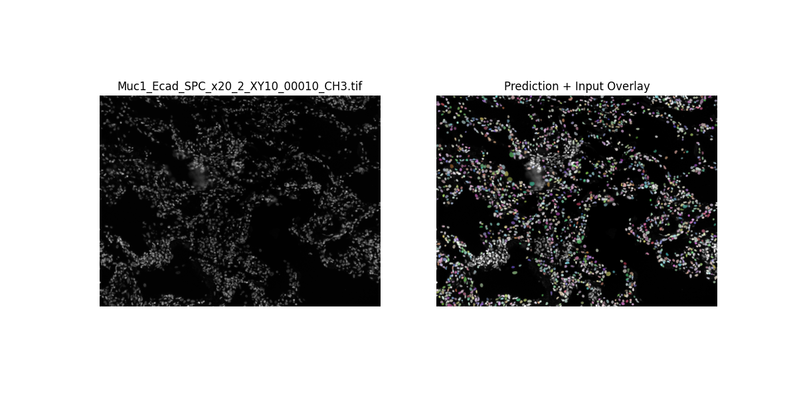
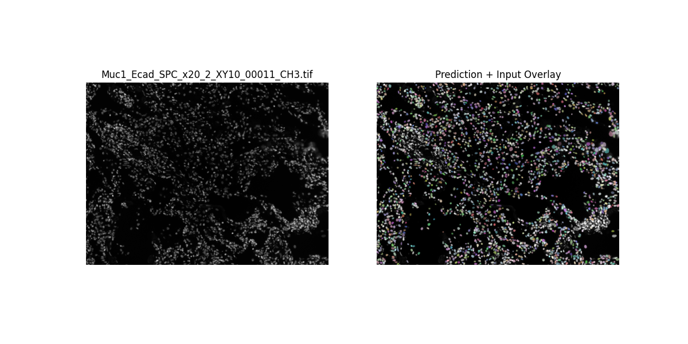
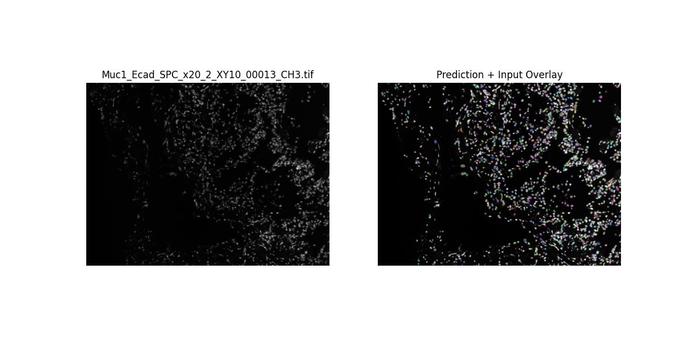
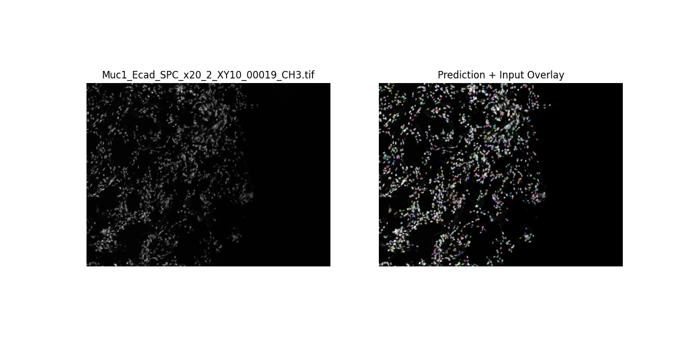

# Neuclei-Segmentation
## In this repository I am giving an overview of Nuclei Segmentation by StatDist tool.
**Author:** [Md Rasul Islam Bapary]  
**Date:** [15.05.2024]\
\
All the files and folders are given in this repository. Please clone the repository for better view.\
Here I am giving some results which I have found during my experiment.
  \
 \
 \
 \
 
